labelme: Image Annotation Tool with Python
==========================================

[](https://pypi.python.org/pypi/labelme)
[](https://travis-ci.org/wkentaro/labelme)
[](https://hub.docker.com/r/wkentaro/labelme)

Requirements
------------

- Ubuntu / macOS / Windows
- Python2 / Python3
- [PyQt4 / PyQt5](http://www.riverbankcomputing.co.uk/software/pyqt/intro)


Installation
------------

**Anaconda**

You need install [Anaconda](https://www.continuum.io/downloads), then run below:

For linux and Mac

```bash
# python2
cd $root_dir_of_labelme
conda create --name=labelme python=2.7
source activate labelme
conda install pyqt
pip install labelme
```

For windows
```bash
# python2
cd $root_dir_of_labelme
conda create --name=labelme python=2.7
activate labelme
conda install pyqt
pip install labelme
```

Usage
-----

**准备**

下载解压[`coco_anno`](https://drive.google.com/file/d/1khGlIo6IMIqf1ib2AJXC4yYMkhb2E0q0/view?usp=sharing)文件夹，把文件夹路径复制到`labelKeypoint/labelme/app.py`的第100行。比如，我的路径是`/mnt/c/Users/ljf_l/Desktop/coco_anno`，则修改如下
``` python
self.datadir = '/mnt/c/Users/ljf_l/Desktop/coco_anno'
```

**Install**
```bash
# Install
$ pip uninstall labelme
$ python setup.py install
```

**运行**

```bash
# Run
$ labelme  # Open GUI
```

**标注**

打开软件之后，选择右侧的open，开始标记

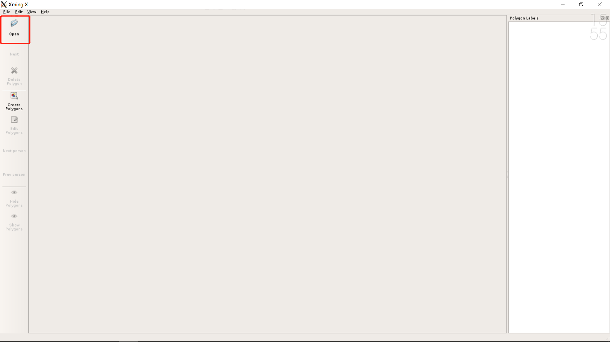

标注的主界面如下

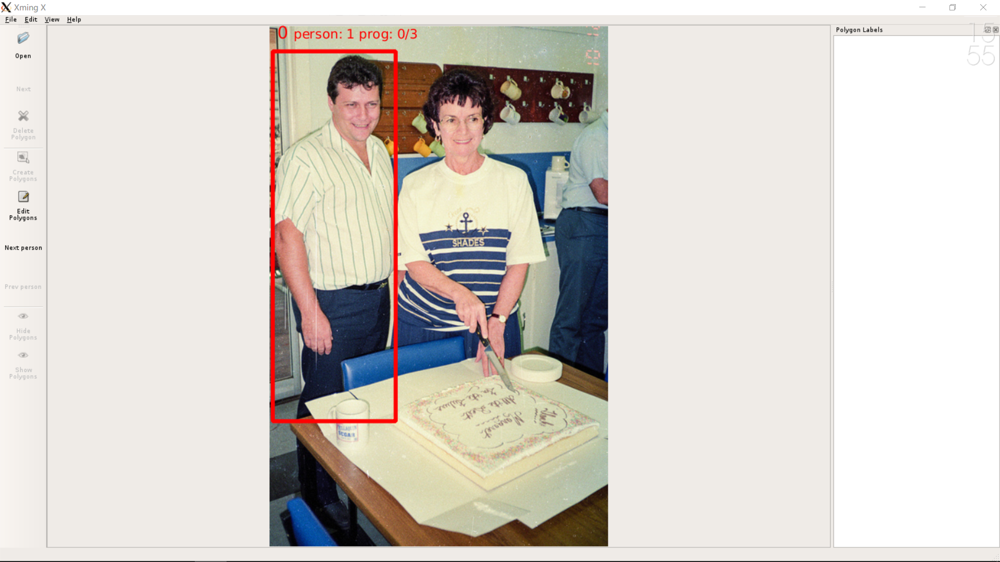

左上方第一个数字表示当前标注的图片序号，`person：`表示当前标记的人的序号，`progress：`表示当前图片已经标记好的人的数量。

点击鼠标左键即可开始标记。

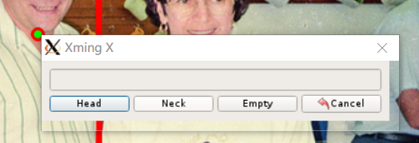

选择`Head`表示标注头部，`Neck`标注脖子。对于没办法预测的部位，可以不标注。如果头和脖子都没有，请在框内任意点击一个位置，选择`Empty`，表示当前人的头和脖子均难以预测，无法标记。

如果对一个人的相同部位重复标记，会弹出提示窗口，关闭即可。

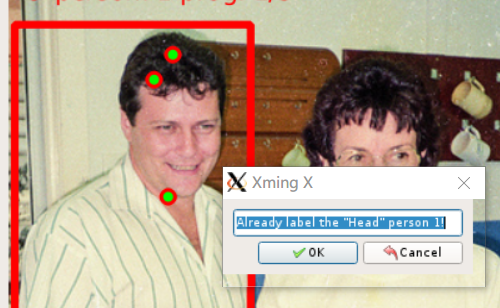

选择`next person`或`prev person`可以切换到不同的人进行标记。


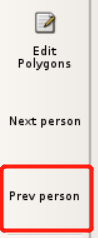

如果标记错误，可选择`Edit`后，在右侧选择相应的部位，进行删除

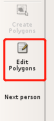
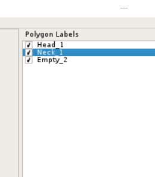

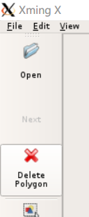

然后点击`Create`重新进入标注状态


当所有人都标记完后，选择`next`标注下一张图。此时程序会自动保存已经标记好的图片。

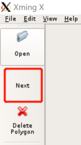

中途如果程序关闭，进度会自动保存，下次点击`open`会从直接上次未标注完成的图片出打开，继续标注。

**标注例子**

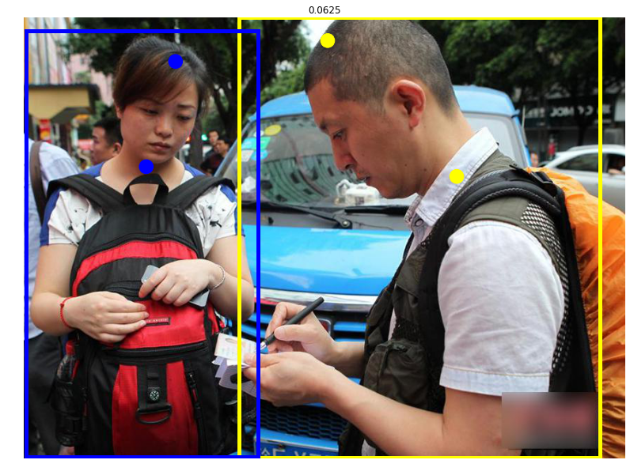

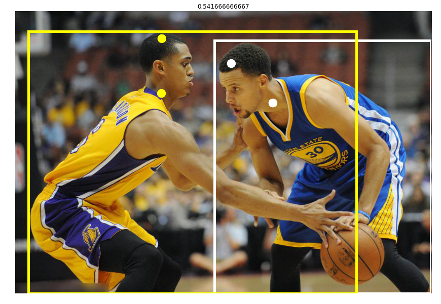

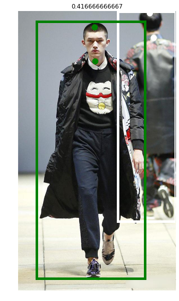


Acknowledgement
---------------

This repo is the fork of [mpitid/pylabelme](https://github.com/mpitid/pylabelme),
whose development has already stopped.
